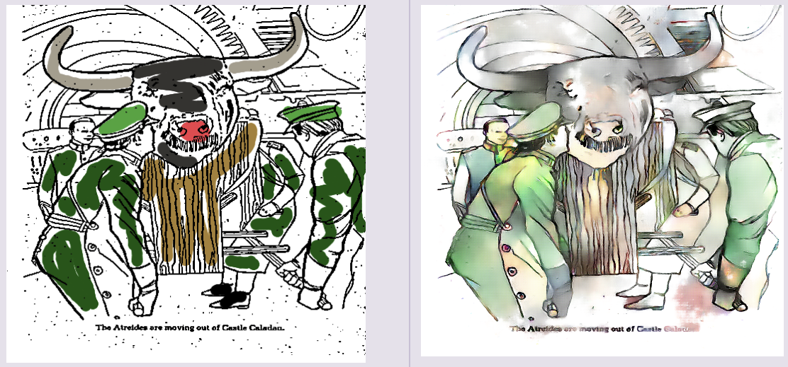

# DeepDune Coloring

Automatic coloring and shading of Dune coloring book using manga-style lineart model from deepcolor. Makes use of Tensorflow + cGANs




## Dune PDF

First download a copy of the coloring book from my S3 bucket

```bash
aws s3 cp s3://devopstar/resources/deep-dune-coloring/dune-coloring-book-remaster.pdf dune-coloring-book-remaster.pdf
```

### Optional - Convert the PDF into pages

```bash
./convert.sh
```

This will dump out the Dune book images to the `dune` folder along with splitting the pages. You will need to have `imagemagick` to do this. The alternative is you can download these pages from my S3 bucket.

```bash
aws s3 sync s3://devopstar/resources/deep-dune-coloring/dune dune/
```

## Deepcolor

Setup Deepcolor using the handy version built by [Kevin Frans](https://github.com/kvfrans) that I've tweaked slightly and put in this repository

### Setup Repo

Create the output directories that will be needed

```bash
cd deepcolor
mkdir results
mkdir imgs
mkdir samples
```

### Python Environment

#### Conda

```bash
## GPU
conda create -n tensorflow_gpuenv_py27 tensorflow-gpu python=2.7 numpy
conda activate tensorflow_gpuenv_py27
pip install opencv-python untangle bottle
```

#### Alternatives

The requirements you will need are:

- Python 2.7
- Tensorflow 1.12
- numpy, opencv-python, untangle, bottle

### Training

If you would like to train your own version you will need to download the training data from Safebooru. This can be done by running the following script.

```bash
# From within deepcolor/
python download_images.py
```

Alternatively you can sync the training set I used down from S3 (If this gets hammers I will remove acces to it)

```bash
# From within deepcolor/
aws s3 sync s3://devopstar/resources/deep-dune-coloring/imgs imgs/
```

### Pre-trained model

If you would like to use the pre-trained model you can pull down a copy from my S3 (If this gets hammers I will remove acces to it. Contact me @nathangloverAUS on twitter if you would like access)

```bash
# From within deepcolor/
aws s3 sync s3://devopstar/resources/deep-dune-coloring/checkpoint checkpoint/
```

You should have a folder structure as follows:

```bash
# From within deepcolor/
checkpoint/
    tr/
        checkpoint
        model-10900500.index
        model-10900500.data-00000-of-00001
        model-10900500.meta
```

### Web Interface

Once you have either run the training task (and have a checkpoint folder) or have downloaded the pretrained model using the command above you should be able to run the web interface that can be used to interact with the model

```bash
# From within deepcolor/
python server.py
```

Open up the web interface on http://localhost:8000

### 

## Attribution

- [Deepcolor: automatic coloring and shading of manga-style lineart](http://kvfrans.com/coloring-and-shading-line-art-automatically-through-conditional-gans/)
- [kvfrans/deepcolor](https://github.com/kvfrans/deepcolor)
- [burness/tensorflow-101](https://github.com/burness/tensorflow-101)
- [pix2pix implementation](https://github.com/yenchenlin/pix2pix-tensorflow)